# Cluster_Index
 

Several clustering indexes implementation

## External Indices

This indexes are designed to measure the similarity of two partitions.

### Indexes based on pair counting
All this indices are based on counting pair depending on wether they belong to the same cluster or not according to the partition C or C'. There are four possibilities:
  * yy : the two points belong to the same cluster according to both C and C'
  * yn : the two points belong to the same cluster according to C but not to C'
  * ny : the two points belong to the same cluster according to C' but not to C
  * nn : the two points does not belong to the same cluster according to C and C'

#### Precision
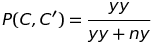
#### Recall
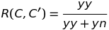
#### Rand Index [[3]](#references)
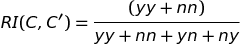
#### Adjusted Rand Index
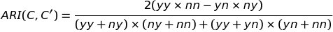
#### Folkes-Mallows Index [[4]](#references)
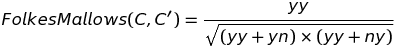
#### Jaccard Index
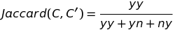
#### Kulczynski Index
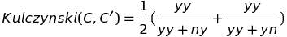
#### McNemar Index
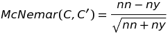
#### Phi Index
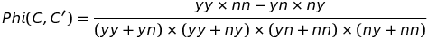
#### Rogers and Tanimoto Index
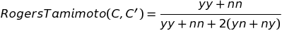
#### Russel and Rao Index
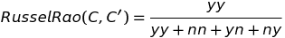
#### Solkal and Sneath Index (version 1 and 2)

#### Hubert Index

#### Mirkin Metric

### Measures based on set overlaps

#### F-measure
Also call Czebanowski-Dice index or Ochiai index

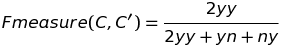

### Measures based on Mutual Information

#### Mutual Information

#### Strehl and Ghosh Normalized Mutual Information

#### Fred and Jain Normalized Mutual Information

#### Variation of Infomation

### Other

#### Purity

#### Entropy

## References

1. Silke Wagner and Dorothea Wagner, Comparing Clustering - An Overview, 2007
3. Bernard Desgraupes, Clustering Indices, 2016, [https://CRAN.R-project.org/package=clusterCrit]
4. Rand, William M.: Objective Criteria for the Evaluation of Clustering Methods. Journal of the American Statistical Association, 66(336):846-850, 1971.
5. Fowlkes, E. B., Mallows, C. L.: A Method for Comparing Two Hierarchical Clusterings. Journal of the American Statistical Association, 78(383):553–569, 1983.

## TODO

* add internal cluster indexes
* complete References section
* add definition and formula for each indexes
